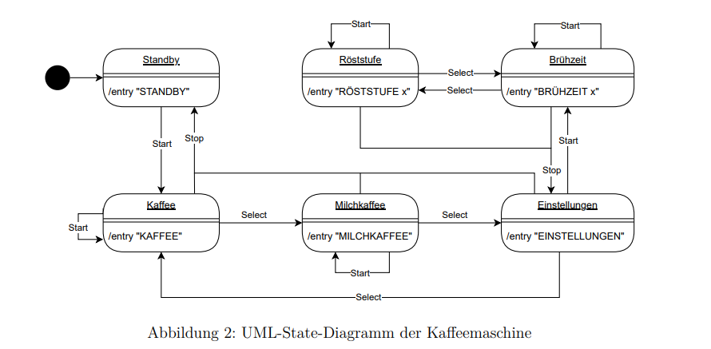

<h1>Kaffeemaschine</h1>
<h2>Aufgabe</h2>
Uns wurde die Aufgabe zugewiesen eine Kaffeemaschine zu erstellen, welches <b>Kaffee und Milchkaffee</b> ausgeben kann. 
Die Brühzeit und Röststufe kann auf <b>HOCH, MITTEL und NIEDRIG</b> eingestellt werden. 
Das Gerät hat drei Knöpfe: <b>Start, Select und Stop</b> wir erhalten auch ein 
UML-State-Diagramm. 

 
Bei einem Zustandswechsel soll jeweils der in den <b>Zuständen angegebene Text in der Konsole erscheinen</b>. 
<b>Nachdem die Brühzeit und Röststufe</b> ausgewählt wurde, muss man sich danach 
zwischen den Einstellung <b>HOCH, MITTEL und NIEDRIG</b> entscheiden. 
Wenn im Zustand Kaffee oder Milchkaffee aud <b>Start</b> gedrückt wird, soll dieser erstellt werden. 
Dies sollen wir simulieren, indem wir einen entsprechenden Text in der Konsole ausgeben. 
Dabei sollen wir auch die eingestellte Röststufe und Brühzeit ausgeben.

<h2>State-Muster</h2>
Wir werden das UML-State-Diagramm mit dem State-Muster umsetzten. 
Dazu benötigen wir die <b>möglichen States und Aktionen</b>:
<table>
    <tr style="border: 0px;">
        <td style="border: 0px;">
            <table>
                <tr>
                    <th><< interface >> State</th>
                </tr>
                <tr>
                    <td>
                        <ul style="padding-left: 0px; list-style: none;">
                            <li>+ start(): void</li>
                            <li>+ select(): void</li>
                            <li>+ stop(): void</li>
                        </ul>
                    </td>
                </tr>
            </table>
        </td>
        <td style="border: 0px;">
           <table>
                <tr>
                    <th>start Zustand</th>
                    <th>Aktion</th>
                    <th>resultierender Zustand</th>
                </tr>
                <tr>
                    <td style="background: rgba(200, 100, 100, 0.5);">z0: Standby</td>
                    <td>Start()</td>
                    <td style="background: rgba(100, 100, 200, 0.5);">z1: Kaffee</td>
                </tr>
                <tr>
                    <td style="background: rgba(100, 100, 200, 0.5);">z1: Kaffee</td>
                    <td>Start()</td>
                    <td style="background: rgba(100, 100, 200, 0.5);">z1: Kaffee</td>
                </tr>
                <tr>
                    <td style="background: rgba(100, 100, 200, 0.5);">z1: Kaffee</td>
                    <td>Select()</td>
                    <td style="background: rgba(200, 200, 100, 0.5);">z2: Milchkaffee</td>
                </tr>
                <tr>
                    <td style="background: rgba(100, 100, 200, 0.5);">z1: Kaffee</td>
                    <td>Stop()</td>
                    <td style="background: rgba(200, 100, 100, 0.5);">z0: Standby</td>
                </tr>
                <tr>
                    <td style="background: rgba(200, 200, 100, 0.5);">z2: Milchkaffee</td>
                    <td>Start()</td>
                    <td style="background: rgba(200, 200, 100, 0.5);">z2: Milchkaffee</td>
                </tr>
                <tr>
                    <td style="background: rgba(200, 200, 100, 0.5);">z2: Milchkaffee</td>
                    <td>Select()</td>
                    <td style="background: rgba(100, 200, 200, 0.5);">z3: Einstellungen</td>
                </tr>
                <tr>
                    <td style="background: rgba(200, 200, 100, 0.5);">z2: Milchkaffee</td>
                    <td>Stop()</td>
                    <td style="background: rgba(200, 100, 100, 0.5);">z0: Standby</td>
                </tr>
                <tr>
                    <td style="background: rgba(100, 200, 200, 0.5);">z3: Einstellungen</td>
                    <td>Start()</td>
                    <td style="background: rgba(0, 250, 0, 0.5);">z4: Brühzeit</td>
                </tr>
                <tr>
                    <td style="background: rgba(100, 200, 200, 0.5);">z3: Einstellungen</td>
                    <td>Select()</td>
                    <td style="background: rgba(100, 100, 200, 0.5);">z1: Kaffee</td>
                </tr>
                <tr>
                    <td style="background: rgba(100, 200, 200, 0.5);">z3: Einstellungen</td>
                    <td>Stop()</td>
                    <td style="background: rgba(200, 100, 100, 0.5);">z0: Standby</td>
                </tr>
                <tr>
                    <td style="background: rgba(0, 250, 0, 0.5);">z4: Brühzeit</td>
                    <td>Start()</td>
                    <td style="background: rgba(0, 250, 0, 0.5);">z4: Brühzeit</td>
                </tr>
                <tr>
                    <td style="background: rgba(0, 250, 0, 0.5);">z4: Brühzeit</td>
                    <td>Select()</td>
                    <td style="background: rgba(0, 0, 250, 0.5);">z5: Röststufe</td>
                </tr>
                <tr>
                    <td style="background: rgba(0, 250, 0, 0.5);">z4: Brühzeit</td>
                    <td>Stop()</td>
                    <td style="background: rgba(100, 200, 200, 0.5);">z3: Einstellungen</td>
                </tr>
                <tr>
                    <td style="background: rgba(0, 0, 250, 0.5);">z5: Röststufe</td>
                    <td>Start()</td>
                    <td style="background: rgba(0, 0, 250, 0.5);">z5: Röststufe</td>
                </tr>
                <tr>
                    <td style="background: rgba(0, 0, 250, 0.5);">z5: Röststufe</td>
                    <td>Select()</td>
                    <td style="background: rgba(0, 250, 0, 0.5);">z4: Brühzeit</td>
                </tr>
                <tr>
                    <td style="background: rgba(0, 0, 250, 0.5);">z5: Röststufe</td>
                    <td>Stop()</td>
                    <td style="background: rgba(100, 200, 200, 0.5);">z3: Einstellungen</td>
                </tr>
            </table>
        </td>
    </tr>
</table>
Wir werden also 6 Zustände implementieren müssen. Wir benötigen zudem auch ein Kontext element, 
welches die Kaffeemaschine ist ==> also benötigen wir eine Klasse Kaffe:
<table>
    <tr>
        <th>Kaffeemaschine</th>
    </tr>
    <tr>
        <td>
            <ul style="list-style: none; padding-left: 0px;">
                <li>- currState: State</li>
                <li>- z0: State</li>
                <li>- z1: State</li>
                <li>- z2: State</li>
                <li>- z3: State</li>
                <li>- z4: State</li>
            </ul>
        </td>
    </tr>
    <tr>
        <td>
            <ul style="list-style: none; padding-left: 0px;">
                <li>+ Kaffeemaschine()</li>
                <li>+ start(): void</li>
                <li>+ select(): void</li>
                <li>+ stop(): void</li>
                <li>+ getState(): State</li>
                <li>+ setState(state: State): void</li>
                <li>+ get_z1_State(): State</li>
                <li>+ get_z2_State(): State</li>
                <li>+ get_z3_State(): State</li>
                <li>+ get_z4_State(): State</li>
                <li>+ get_z5_State(): State</li>
                <li>+ get_z0_State(): State</li>
            </ul>
        </td>
    </tr>
</table>
<h2>Testing</h2>
Als test führen wir folgende Eingabefolge aus:  
<code>Start, Select, Select, Start, Select, Stop, Select, Start, Stop</code>

Die ausgabe ist folgendes:  
<ol>
    <li>Kaffee</li>
    <li>Milchkaffee</li>
    <li>Brühzeit</li>
    <li>Brühzeit</li>
    <li>Röststufe</li>
    <li>Einstellungen</li>
    <li>Kaffee</li>
    <li>kaffee</li>
    <li>Standby</li>
</ol>

